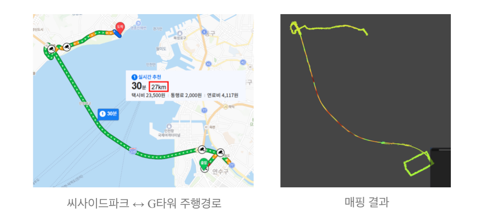
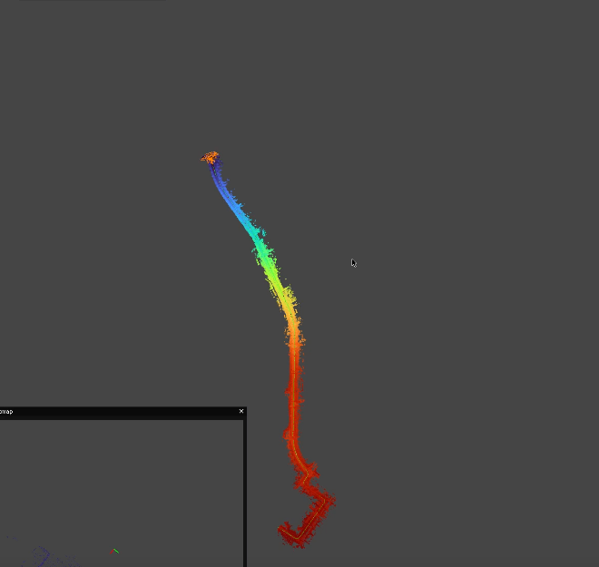
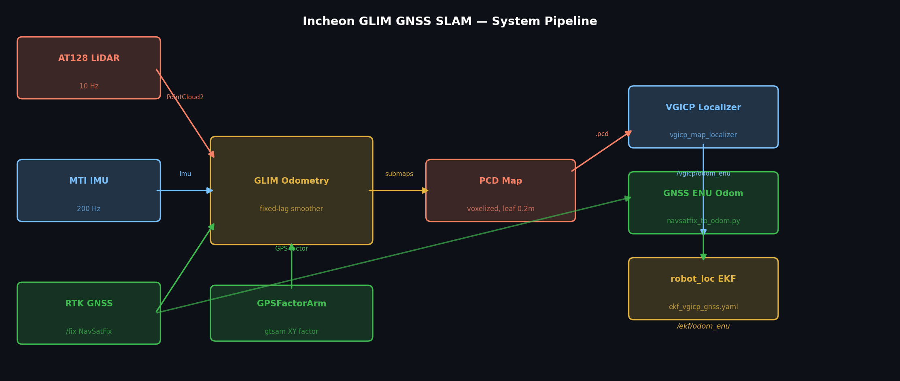
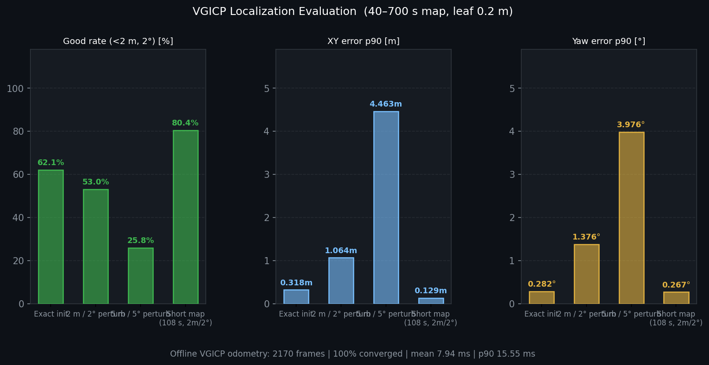

# Incheon GLIM GNSS SLAM

AT128 LiDAR + MTI IMU + RTK GNSS로 장거리 offline PCD map을 구축하고, VGICP localization과 GNSS EKF fusion으로 차량 위치를 추정하는 ROS2 workspace입니다.

## Result



씨사이드파크 ↔ G타워 27 km 구간. 좌측은 실제 주행 경로, 우측은 GLIM GNSS SLAM 매핑 결과.



GLIM odometry submap trajectory. Blue(시작) → Red(종료).

## Why

인천대교처럼 ~27 km 동안 구조가 반복되는 구간은 LiDAR-IMU만으로 scan matching이 퇴화하기 쉽습니다. EKF post-processing만으로는 이미 깨진 odometry/submap을 살리기 어렵기 때문에, GNSS factor를 GLIM odometry graph에 직접 넣었습니다.

```text
LiDAR + IMU + GNSS factor  →  GLIM odometry fixed-lag smoother  →  PCD map
PCD map + VGICP localizer + GNSS odom  →  robot_localization EKF
```

핵심 구현:

- `glim_ext/modules/odometry/gnss_odometry`: `NavSatFix` → `gtsam::GPSFactorArm` on odometry frame
- `glim_ros2/src/vgicp_map_localizer_node.cpp`: PCD map 기반 VGICP localizer
- `glim_ros2/scripts/navsatfix_to_odom.py`: GNSS ENU odometry
- `glim_ros2/config/ekf_vgicp_gnss.yaml`: VGICP + GNSS EKF config

## System Pipeline



## Configs

| Preset | Use |
|---|---|
| `configs/glim_gnss_odom_gpu_xy` | 기본 추천. GNSS XY factor + GPU GLIM |
| `configs/glim_gnss_odom_gpu_xy_loop` | 재방문 route에서 loop closure까지 켤 때 |
| `configs/glim_nognss_gpu_baseline` | GNSS 없는 비교용 baseline |

Default GNSS factor는 XY만 약하게 겁니다. RTK altitude는 강하게 믿지 않습니다.

## Build

```bash
cd /root/incheon_glim_slam_src
source /opt/ros/humble/setup.bash
colcon build --symlink-install --cmake-args -DCMAKE_BUILD_TYPE=Release
source install/setup.bash
```

확인된 빌드: `glim`, `glim_ext`, `glim_ros` 성공.

## Mapping

40–700초 구간 map 생성:

```bash
./scripts/run_mapping_40_700.sh /data/processed_bags/clock_synced_fixed_v1
```

직접 실행:

```bash
ros2 run glim_ros glim_rosbag /data/processed_bags/clock_synced_fixed_v1 \
  --ros-args \
  -p config_path:=/root/incheon_glim_slam_src/configs/glim_gnss_odom_gpu_xy \
  -p dump_path:=/maps/glim_40_700_gnss_odom_gpu_xy \
  -p start_offset:=40.0 \
  -p playback_duration:=660.0 \
  -p auto_quit:=true
```

재방문이 있는 route는 `configs/glim_gnss_odom_gpu_xy_loop`를 사용합니다. 단, 인천대교처럼 one-way 직선 주행은 loop closure 기회가 거의 없습니다.

## Export

```bash
./scripts/export_map.sh \
  /maps/glim_40_700_gnss_odom_gpu_xy \
  /maps/exports/glim_40_700_gnss_odom_gpu_xy_leaf020
```

## Localization Eval

```bash
./scripts/eval_vgicp_localization.sh \
  /data/processed_bags/clock_synced_fixed_v1 \
  /maps/exports/glim_40_700_gnss_odom_gpu_xy_leaf020.pcd \
  /maps/glim_40_700_gnss_odom_gpu_xy/traj_lidar.txt
```

CSV 요약:

```bash
./scripts/summarize_localization_csv.py /maps/exports/localize_eval_prebridge_40_700_gpu_stable_2m2deg_leaf05.csv
```

## VGICP + GNSS EKF

```bash
./scripts/run_vgicp_gnss_ekf.sh /maps/exports/glim_40_700_gnss_odom_gpu_xy_leaf020.pcd
```

Outputs:

- `/vgicp/odom_enu`
- `/gnss/odom_enu`
- `/ekf/odom_enu`

주의: EKF는 map frame과 GNSS ENU frame의 yaw/translation을 자동으로 맞추지 않습니다. 필요하면 `MAP_TO_OUTPUT_X/Y/YAW_DEG`를 설정해야 합니다.

## Current Metrics



| Test | Scans | Good `<2m, 2°` | XY p90 | Yaw p90 |
|---|---:|---:|---:|---:|
| 40–700s, exact init | 66 | 62.1% | 0.318 m | 0.282° |
| 40–700s, 2m/2° perturb | 66 | 53.0% | 1.064 m | 1.376° |
| 40–700s, 5m/5° perturb | 66 | 25.8% | 4.463 m | 3.976° |
| 108s short map, 2m/2° perturb | 51 | 80.4% | 0.129 m | 0.267° |

Offline VGICP odometry: `2170 frames` · `100% converged` · mean `7.94 ms` · p90 `15.55 ms`

## Limits

- GNSS는 `/fix` position factor입니다. Raw carrier/pseudorange tightly-coupled GNSS가 아닙니다.
- AT128 LiDAR를 전방 단일 구성으로 운용했기 때문에 측후방 포인트가 부족하여 완전한 360° PCD map 구성에 한계가 있습니다.
- IMU가 100 Hz로 제한된 환경이라 고속 주행 구간에서 pre-integration 정밀도가 떨어지고, scan-to-map matching에 미세한 오차가 발생할 수 있습니다.
- Loop closure는 재방문 구간이 있어야 의미 있습니다.
- 깨진 timestamp/scan은 config로 완전히 복구할 수 없습니다.
- 실제 주행 EKF는 map-to-ENU alignment를 별도로 맞춰야 합니다.
